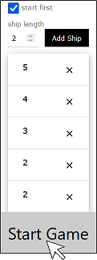

# Battleship

Battleship is a strategy game where each player tries to guess the position of the opposite ships on an 8x8 grid.

## Requirements

 - Java 12
 - com.sun.net.httpserver (included in OpenJDK or Oracle jdk) 

## Start game

Open a shell and change to the battleship folder.

```
cd battleship folder
```

Start hosting the battleship server on your desired port (e.g. 8000).

```
battleship folder>java -jar battleship.jar port
```

## Game description
Before you can start the game, you have to define the number and the lengths of the ships.
Therefore, you can enter the length of one ship and press "Add Ship".
Additionally, you can decide if you want to make the first guess by checking the "start first" checkbox.


After all ship lengths are defined the game can be started by the "Start Game" button.



Next, you have to place the ships on your "Friendly Board".
The ships can be dragged from the "Ships" section onto the board.


To rotate a ship, click on it in the "Ships" section.


Place all ships on your "Friendly Board".


Then, start guessing where your opponent has placed his ships.
Therefore, click on a field on the "Enemy Board", where you think a ship could be.


A red field indicates an existing ship, whereas a blue field is a miss.
Friendly ships on the "Friendly Board" are marked black.


After you clicked on a field, the PC-Player immediately guesses a field on your field.


The field "B3" is a miss.


After a few turns four ships are destroyed, but one ship of length 2 is still hidden.


The opponent has discovered all five ships and his next strike on "H7" will destroy the last friendly ship.


The end of the game is schonw either by a


or


box.
